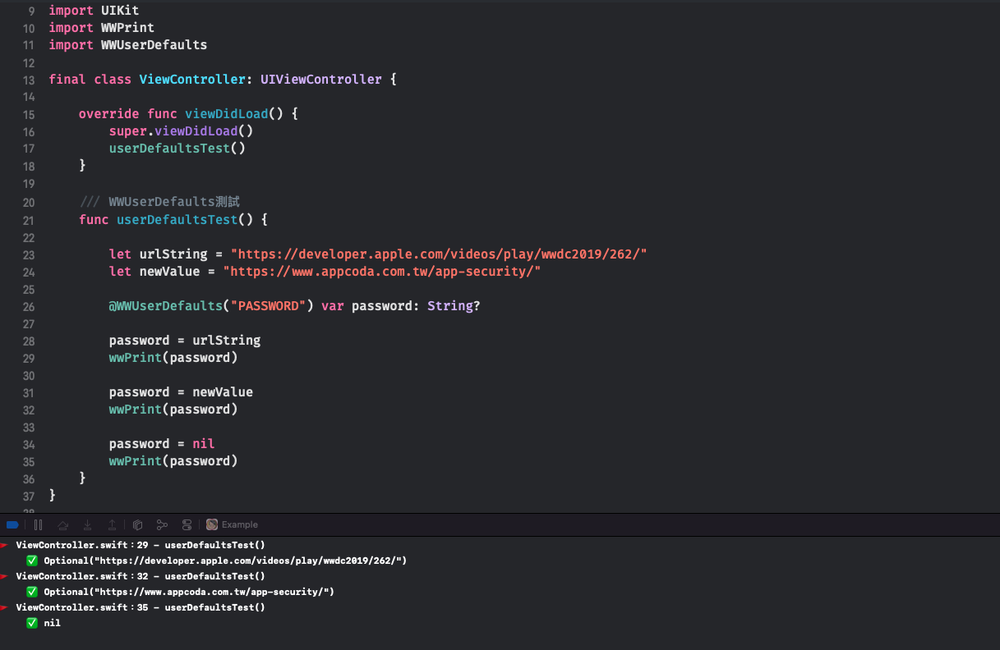

# WWUserDefaults

[](https://developer.apple.com/swift/) [](https://developer.apple.com/swift/) [](https://developer.apple.com/swift/) [](https://developer.apple.com/swift/) 

### [Introduction - 簡介](https://swiftpackageindex.com/William-Weng)
- Use the "property wrapper" to make an enhanced version of UserDefaults.
- 利用「屬性包裝器」做成UserDefaults加強版。



### [Installation with Swift Package Manager](https://medium.com/彼得潘的-swift-ios-app-開發問題解答集/使用-spm-安裝第三方套件-xcode-11-新功能-2c4ffcf85b4b)
```swift
dependencies: [
    .package(url: "https://github.com/William-Weng/WWUserDefaults.git", .upToNextMajor(from: "1.1.0"))
]
```

## Function - 可用函式
|函式|功能|
|-|-|
|@WWUserDefaults()|修飾子 (純值)|
|@WWUserDefaultsCodable()|修飾子 (Codable)|

### Example
```swift
import UIKit
import WWUserDefaults

final class ViewController: UIViewController {

    struct User: Codable {
        let id: UUID
        let name: String
        let settings: [String: Bool]
    }
    
    @WWUserDefaults("Password") var password: String?
    @WWUserDefaultsCodable("Current.User") var currentUser: User?
        
    override func viewDidLoad() {
        super.viewDidLoad()
        valueTest()
        structTest()
    }
    
    func valueTest() {
        
        let urlString = "https://developer.apple.com/videos/play/wwdc2019/262/"
        let newValue = "https://www.appcoda.com.tw/app-security/"
        
        password = urlString
        print(password!)
        
        password = newValue
        print(password!)
        
        password = nil
        print($password)
    }
    
    func structTest() {
        
        let user = User(id: UUID(), name: "William", settings: ["darkMode": true])
        currentUser = user
        
        if let user = currentUser {
            print("ID: \(user.id)")
            print("Name: \(user.name)")
            print("Dark: \(user.settings)")
        }
        
        currentUser = nil
        print($currentUser)
    }
}
```
